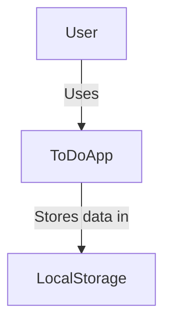
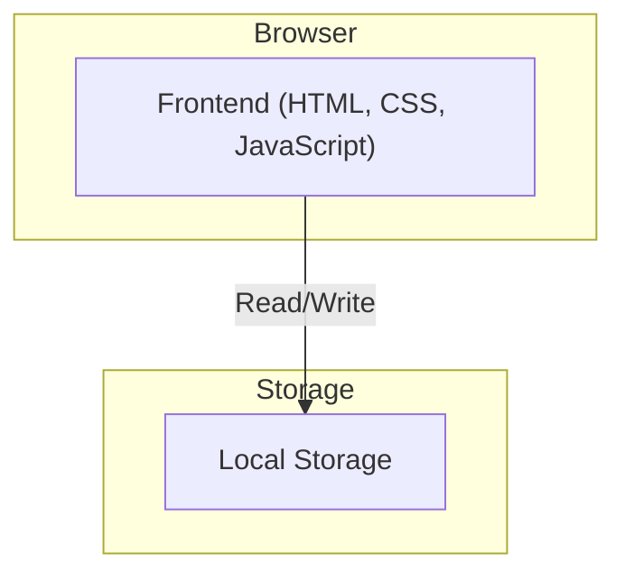
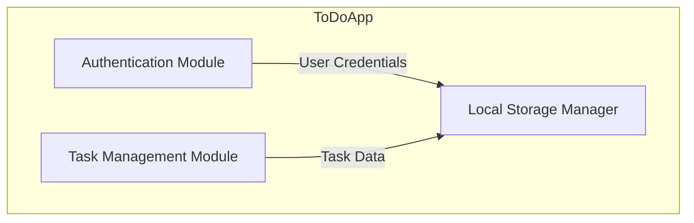
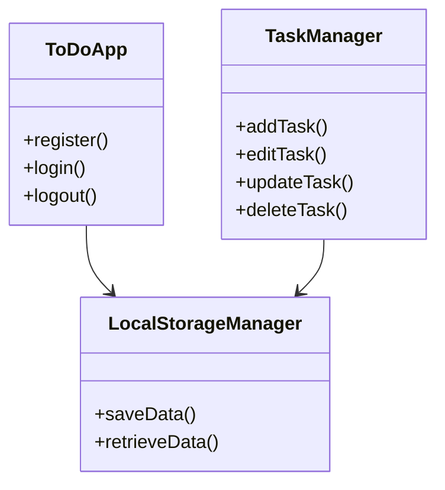

# System Architecture: To-Do App

## Project Title: To-Do App

## Domain: Productivity Tools

### Problem Statement

The To-Do App is designed to help users manage their tasks by allowing them to create, update, and delete tasks. The system stores user data in the browser's local storage to persist tasks across sessions. The system aims to be lightweight, fast, and simple, focusing on user-friendliness.

### Individual Scope

The app is designed with individual users in mind, providing them with full control over their tasks without requiring a server-side backend. The application’s scope includes the following key components:

- **User Interface**: Consists of the registration page, login page, and task management page.
- **Data Storage**: Uses the browser’s local storage to persist user information and tasks.
- **User Authentication**: Users can register, log in, and authenticate using their email and password.
- **Task Management**: Users can add, edit, delete, and mark tasks as complete/incomplete.

## Architectural Overview

The system uses a client-side architecture, with data being stored locally in the user’s browser. Here is a high-level view of the architecture:

1. **User Interface (UI)**:
   - Registration page for new users to sign up.
   - Login page for returning users to access their tasks.
   - Task management page that displays tasks and allows task manipulation.

2. **Data Persistence**:
   - Local Storage is used to store user data (email, password) and task data (task name, description, status).

3. **Client-Side Logic**:
   - JavaScript is used to handle user interactions, such as form submissions and task updates.
   - Data is retrieved and saved using local storage APIs (`localStorage.setItem()` and `localStorage.getItem()`).

## 2. C4 Model Architecture

### 2.1 Context Diagram
- **Actors:**
  - User: Interacts with the application via a web browser.
- **System:**
  - To-Do List Web Application
- **External Dependencies:**
  - Browser Local Storage (for data persistence)
  
**Diagram Representation (Mermaid Syntax):**

### 2.2 Container Diagram  
**Main Containers:**  
- **Frontend (Web Application):** Handles UI interactions and task management logic.  
- **Local Storage:** Used for storing user authentication data and tasks.  

**Diagram Representation:**  

### 2.3 Component Diagram
**Key Components:**
- **Authentication Module:** Manages user registration, login, and logout.
- **Task Management Module:** Allows users to add, edit, update, and delete tasks.
- **Local Storage Manager:** Handles storing and retrieving data.

**Diagram Representation:**

### 2.4 Code Diagram 
A high-level breakdown of core modules and their relationships:

### Feasibility Justification

The architecture is simple and does not require any external servers or databases, which makes the project highly feasible for development with minimal overhead. The local storage solution ensures data is persisted across sessions without the need for complex backend services. This approach also allows for faster development and deployment.

## 3. Technology Stack
- **Frontend:** HTML, CSS, JavaScript
- **Storage:** Local Storage (Browser-based)

## 4. Future Enhancements
- Implement a backend with Firebase or Node.js. (forgot password functionality)
- Add reminders and notifications.
- Introduce task categorization and priorities.
- Develop a mobile app version.
  

