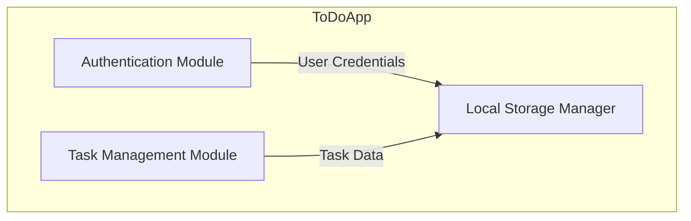

# To-Do List Application Architecture

## 1. Introduction

### Project Title:
To-Do List Application

### Domain: Productivity

### Problem Statement:
Users often struggle with managing daily tasks efficiently. This To-Do List application allows users to register, log in, and manage their tasks seamlessly. The system will leverage local storage for persistence, ensuring task history is maintained across sessions.

### Individual Scope:
This system is a single-page web application (SPA) designed for individual use. It does not require backend integration, making it lightweight and highly feasible for development within the given timeframe.

## C4 Model Architecture

  ###  Context Diagram
- **Actors:**
  - User: Interacts with the application via a web browser.
- **System:**
  - To-Do List Web Application
- **External Dependencies:**
  - Browser Local Storage (for data persistence)
  
**Diagram Representation:**

graph TD;
  User -->|Uses| ToDoApp
  ToDoApp -->|Stores data in| LocalStorage

  ### Container Diagram
**Main Containers:**
- **Frontend (Web Application):** Handles UI interactions and task management logic.
- **Local Storage:** Used for storing user authentication data and tasks.

**Diagram Representation:**
```mermaid
graph TD;
  subgraph Browser
    UI[Frontend (HTML, CSS, JavaScript)]
  end
  subgraph Storage
    LS[Local Storage]
  end
  UI -->|Read/Write| LS
```

  ### Component Diagram
**Key Components:**
- **Authentication Module:** Manages user registration, login, and logout.
- **Task Management Module:** Allows users to add, edit, update, and delete tasks.
- **Local Storage Manager:** Handles storing and retrieving data.

**Diagram Representation:**


  ## Code Diagram 
A high-level breakdown of core modules and their relationships:
classDiagram
  class ToDoApp {
    +register()
    +login()
    +logout()
  }
  class TaskManager {
    +addTask()
    +editTask()
    +updateTask()
    +deleteTask()
  }
  class LocalStorageManager {
    +saveData()
    +retrieveData()
  }
  ToDoApp --> LocalStorageManager
  TaskManager --> LocalStorageManager

## Technology Stack
- **Frontend:** HTML, CSS, JavaScript
- **Storage:** Local Storage (Browser-based)

---

## 4. Future Enhancements
- Implement a backend with Node.js.
- Add reminders and notifications.
- Introduce task categorization and priorities.
- Develop a mobile app version.


