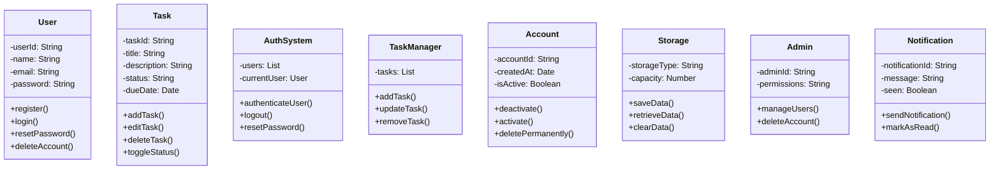

Class Diagram

User "1" -- "0..*" Task : owns
User "1" -- "1" Account : has
AuthSystem "1" --> "0..*" User : manages
TaskManager "1" --> "0..*" Task : manages
User --> Storage : uses
Task --> Storage : uses
User "1" -- "0..*" Notification : receives
Admin --|> User : inherits
