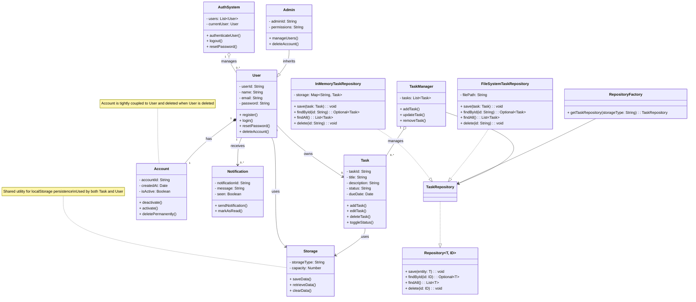

Class Diagram

```mermaid
classDiagram
%% =====================
%% Classes with attributes and methods
%% =====================

class User {
  - userId: String
  - name: String
  - email: String
  - password: String
  + register()
  + login()
  + resetPassword()
  + deleteAccount()
}

class Task {
  - taskId: String
  - title: String
  - description: String
  - status: String
  - dueDate: Date
  + addTask()
  + editTask()
  + deleteTask()
  + toggleStatus()
}

class AuthSystem {
  - users: List~User~
  - currentUser: User
  + authenticateUser()
  + logout()
  + resetPassword()
}

class TaskManager {
  - tasks: List~Task~
  + addTask()
  + updateTask()
  + removeTask()
}

class Account {
  - accountId: String
  - createdAt: Date
  - isActive: Boolean
  + deactivate()
  + activate()
  + deletePermanently()
}

class Storage {
  - storageType: String
  - capacity: Number
  + saveData()
  + retrieveData()
  + clearData()
}

class Admin {
  - adminId: String
  - permissions: String
  + manageUsers()
  + deleteAccount()
}

class Notification {
  - notificationId: String
  - message: String
  - seen: Boolean
  + sendNotification()
  + markAsRead()
}

%% Repository Layer
class Repository~T, ID~ {
  + save(entity: T): void
  + findById(id: ID): Optional~T~
  + findAll(): List~T~
  + delete(id: ID): void
}

class TaskRepository
%% Removed empty curly braces to avoid errors

class InMemoryTaskRepository {
  - storage: Map~String, Task~
  + save(task: Task): void
  + findById(id: String): Optional~Task~
  + findAll(): List~Task~
  + delete(id: String): void
}

class FileSystemTaskRepository {
  - filePath: String
  + save(task: Task): void
  + findById(id: String): Optional~Task~
  + findAll(): List~Task~
  + delete(id: String): void
}

class RepositoryFactory {
  + getTaskRepository(storageType: String): TaskRepository
}

%% =====================
%% Relationships
%% =====================

%% Association: A User owns many Tasks (1..*), and a Task belongs to one User
User "1" --> "0..*" Task : owns

%% Composition: A User has exactly one Account (strong lifecycle dependency)
User "1" *-- "1" Account : has

%% Aggregation: AuthSystem contains Users but can exist independently
AuthSystem "1" o-- "0..*" User : manages

%% Aggregation: TaskManager holds a collection of Tasks
TaskManager "1" o-- "0..*" Task : manages

%% Association: A User interacts with Storage (localStorage)
User --> Storage : uses
Task --> Storage : uses

%% Association: A User receives many notifications
User "1" --> "0..*" Notification : receives

%% Inheritance: Admin is a specialized type of User
Admin --|> User : inherits

%% Note: Storage is a shared utility class, used by both Task and User
note for Storage "Shared utility for localStorage persistence\nUsed by both Task and User"

%% Note For Account
note for Account "Account is tightly coupled to User and deleted when User is deleted"

TaskRepository ..|> Repository~Task, String~
InMemoryTaskRepository ..|> TaskRepository
FileSystemTaskRepository ..|> TaskRepository
RepositoryFactory --> TaskRepository

TaskManager --> TaskRepository

```
