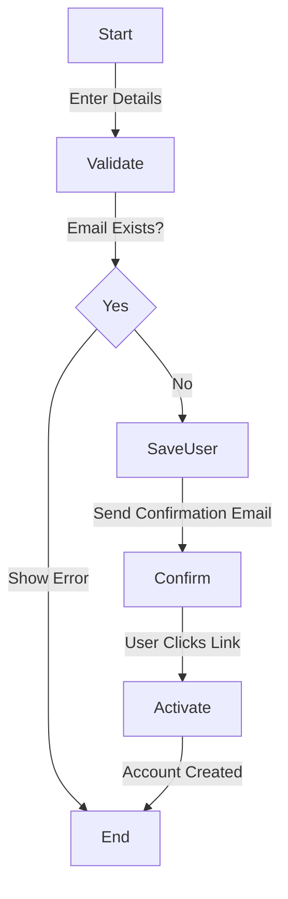
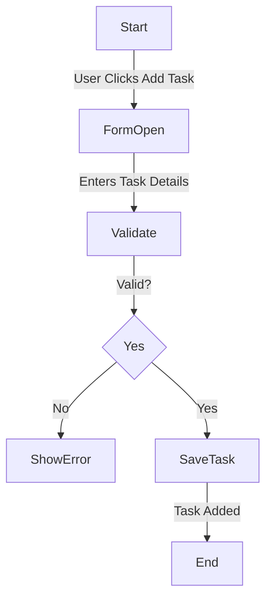

## User Registration Workflow

#### Explanation
- Ensures valid email registration.
- Prevents duplicate accounts.
- Functional Requirement Mapping: FR-001 (User Registration)

## Task Addition Workflow

#### Explanation
- Ensures valid task creation.
- Functional Requirement Mapping: FR-002 (Task Management)
