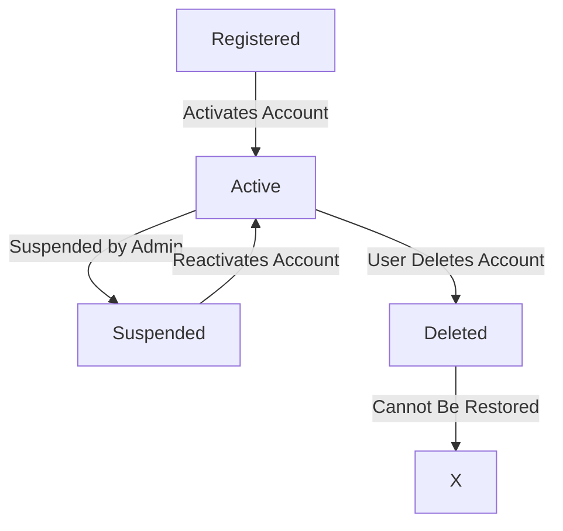
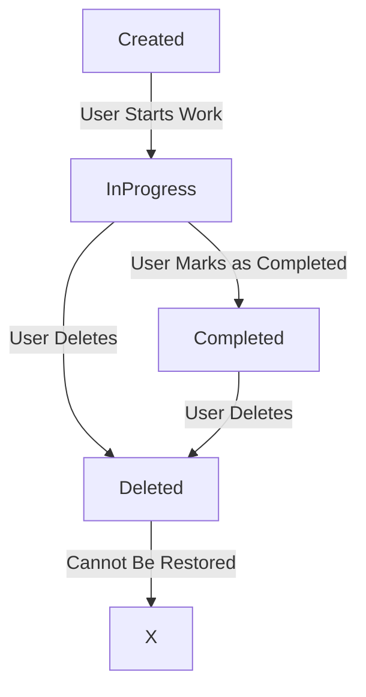

## User Account State Transition Diagram

   # Explanation

Registered: The user has signed up but hasn't activated the account.

Active: The user can log in and manage tasks.

Suspended: The admin can suspend an account.

Deleted: The user deletes their account permanently.

Functional Requirement Mapping: Ensures account management as per FR-001 (User Registration & Management). 

## Task State Transition Diagram

#### Explanation
- **Created**: The task is added but not started.
- **InProgress**: The task is actively being worked on.
- **Completed**: The user marks the task as done.
- **Deleted**: The task is removed permanently.
- **Functional Requirement Mapping**: FR-002 (Task Management) is satisfied
